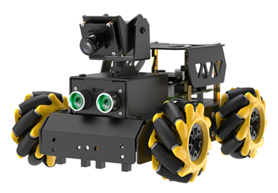

# TurboPi Robot

We will be using the **TurboPi** robot for our design challenge. The **TurboPi** uses a **RaspberryPi** to control it which has much higher processing capabilities than an **Arduino**. Watch the video below to witness what it can do. 

[TurboPi Robot Video](https://www.youtube.com/watch?v=an129hkrHlg)

## Install Real VNC Viewer

VNC is a graphical remote desktop control software. Through connecting your
computer to the WiFi generated by Raspberry Pi, you can control the Raspberry Pi. Go to Company Portal on your Culver issued laptop and install **Real VNC Viewer**. 

## Connecting to the TurboPi Robot

* Turn on the TurboPi robot (both switches) and wait until it beeps.
* TurboPi generates a WiFi starting with HW-. Connect your computer to this WiFi. The specific WiFi network is on the robot.
* Input the password **hiwonder** for the Wifi password. 
* After connecting, open **Real VNC Viewer** software that you downloaded from Company Portal. 
* Input the IP address **192.168.149.1** and then press **Enter**.
* Input the Username and Password.
* Username is **pi**
* Password is **raspberry** then click OK. 
