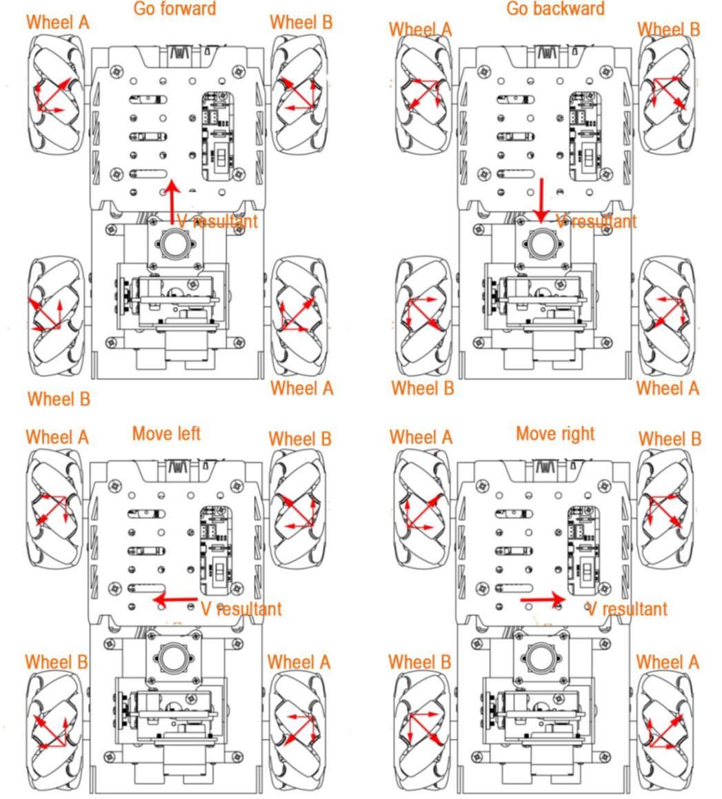
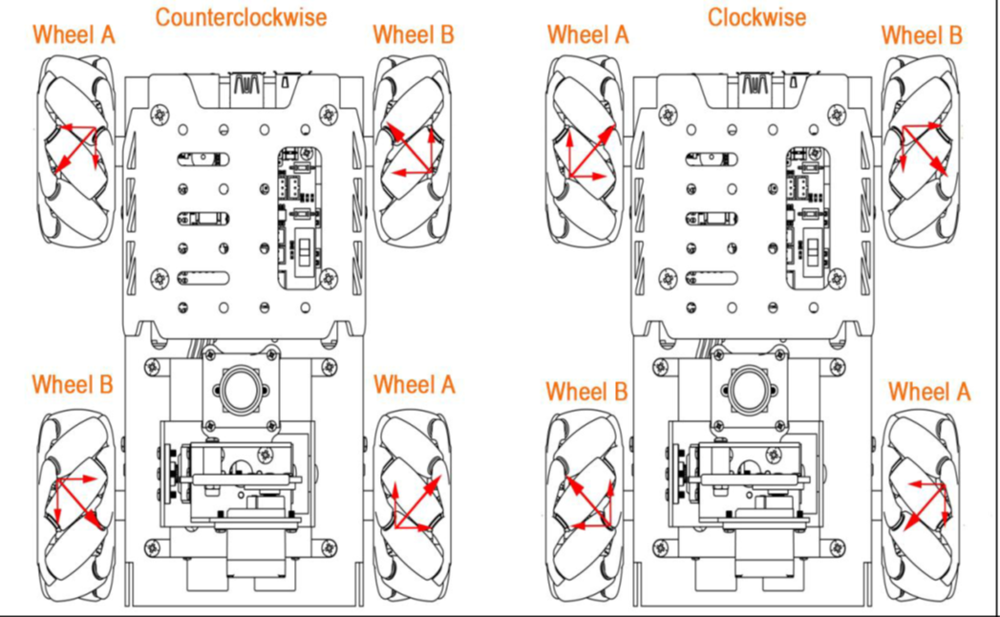

# TurboPi Robot

  Image Credit: [HiWonder.com](https://www.hiwonder.com/products/turbopi?variant=40112905388119)

We will be using the **TurboPi** robot for our design challenge. The **TurboPi** uses a **RaspberryPi** to control it which has much higher processing capabilities than an **Arduino**. Watch the video below to witness what it can do. 

[TurboPi Robot Video](https://www.youtube.com/watch?v=an129hkrHlg) 

## Install Real VNC Viewer

VNC is a graphical remote desktop control software. Through connecting your
computer to the WiFi generated by Raspberry Pi, you can control the Raspberry Pi. Go to Company Portal on your Culver issued laptop and install **Real VNC Viewer**. 

## Connecting to the TurboPi Robot

* Turn on the TurboPi robot (both switches) and wait until it beeps.
* TurboPi generates a WiFi starting with HW-. Connect your computer to this WiFi. The specific WiFi network is on the robot. Be sure not to connect to other TurboPi robots in the room. 
* Input the password **hiwonder** for the Wifi password. 
* After connecting, open **Real VNC Viewer** software that you downloaded from Company Portal. 
* Input the IP address **192.168.149.1** and then press **Enter**.
* Input the Username and Password.
* Username is **pi**
* Password is **raspberry** then click OK.

## Getting the TurboPi Robot to Move

According to characteristic of the mecanum wheel, only when **ALL** wheels rotate
**forward** does the car go forward. When **ALL** wheels rotate in **reverse**, the car goes
backward. When A wheels rotate in reverse and B wheels rotate forward, the car **tranlates**
to the left. When B wheels rotate in reverse and A wheels rotate forward, the car
**tranlates** to the right. The analysis of force is as pictured.

  Image Credit: [HiWonder.com](https://www.hiwonder.com.cn/store/learn/117.html)

Now you will work on programming the TurboPi Robot to move in various directions. 
You must demonstrate the following movements to your instructor in class with your robot. Use the [TurboPi Move Forward, Backward, Left, and Right.pdf](https://drive.google.com/file/d/1tCgWk_yjmzWOclA-Nno3G_lW1cvJ29Ni/view?usp=drive_link) document (along with your instructor's help ) to program the robot through the **Real VNC Viewer** software. 

**Movements to demonstrate to instructor**
* Move forward for 1 second with a speed of 50, then stop indefinitely
* Move backward for 2 seconds with a speed of 25, then stop indefinitely
* Move to the left for 1 second with a speed of 75, then stop indefinitely
* Move to the right for 0.5 seconds with a speed of 100, then stop indefinitely
* Move in a square (forward, right, backward, left) making the round trip 5 seconds long, then stop indefinitely

## Getting the TurboPi Robot to Turn

According to the characteristics of the mecanum wheel, when only two left wheels
rotate in reverse and two right wheels rotate forward, the car turns
**counterclockwise** on the spot. When two left wheels rotate forward and two
right wheels rotate in reverse, the car turns **clockwise** on the spot. The analysis of
force is as pictured.

  Image Credit: [HiWonder.com](https://www.hiwonder.com.cn/store/learn/117.html)

Now you will work on programming the TurboPi Robot to turn **counterclockwise** and **clockwise**. 
You must demonstrate the following movements to your instructor in class with your robot. Use the [TurboPi Rotating.pdf](https://drive.google.com/file/d/1CbrnBQZT-vjS1WbPN6FqY1I4YLGYoaZE/view?usp=drive_link) document to program the robot through the **Real VNC Viewer** software. 

**Movements to demonstrate to instructor**
* Rotate clockwise for 1 second with a speed of 50, then stop indefinitely
* Rotate counterclockwise for 2 seconds with a speed of 25, then stop indefinitely
* Move forward for 1 sec at speed 50, turn 180 degrees, and move forward (back to the starting point) at speed 100 and stop where you started
* Make a **continuous** figure eight approximately 2 feet by four feet using only forward movements and rotations.
